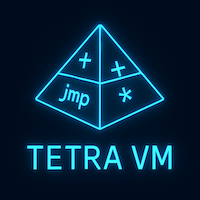
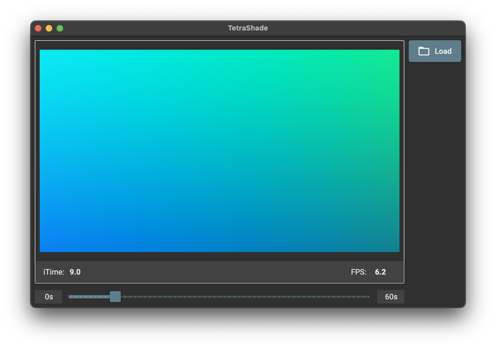

[](https://twitter.com/deanthecoder)
<p align="center">
  
</p>

# Tetra VM

**Tetra** is a custom bytecode language designed for numerical and graphical computation. It’s versatile enough for general purpose logic, but also for expressing GLSL-style shader behavior.

Tetra code is executed by a lightweight, cross-platform virtual machine runtime written in C#. Programs are made up of simple, low-level instructions using named variables, vector math, and clean control flow.

## TetraShade


**TetraShade** is a cross-platform UI for visualizing Tetra bytecode that simulates a fragment shader pipeline. Each pixel is computed by running the loaded Tetra code with a `fragCoord` input, allowing real-time visual output from shader-style programs.

Credit: ["Shield"](https://www.shadertoy.com/view/cltfRf) visual effect by [Xor](https://X.com/XorDev).

## 🛠️ Language Features

- **Scoped Variable Stack**: Each block or function has its own variable frame. Stack frames are explicitly
  pushed/popped using `push_frame` / `pop_frame`.
- **Named Variables**: No general-purpose registers. All values are stored and looked up by name.
- **Conditional and Unconditional Jumps**: Support for jump labels like `mylabel:` and instructions like `jmp`,
  `jmpz` and `jmpnz`.
- **Multi-element Float Vector Support**: Support for `vec4` operations alongside scalar floats.
- **Basic Arithmetic**: Instructions like `add`, `sub`, `inc`, `dec`.
- **Debugging Aids**: A `print` instruction that outputs variable values along with the line number of the source
  instruction.
- **Globals Support**: A global frame is automatically pushed on startup. Any code variables defined at the root level are treated as
  global initialization.

## 📌 Example Tetra Programs

### 🥧 Pi Approximation

Demonstrates use of arithmetic, loops, and alternating signs to compute an approximation of π using the Leibniz formula:

```tetra
ld $sum, 0
ld $sign, 1
ld $i, 0
ld $limit, 800

loop:
    ld $c, $i
    ge $c, $limit
    jmpnz $c, done
    ld $denominator, $i
    mul $denominator, 2
    add $denominator, 1
    ld $term, 1.0
    div $term, $denominator
    mul $term, $sign
    add $sum, $term
    neg $sign
    inc $i
    jmp loop

done:
    mul $sum, 4
    print $sum
    halt
```

#### Output
```
sum = 3.1403f
```
### 🧮 Fibonacci Sequence

Recursively computes and prints the first 10 [Fibonacci numbers](https://en.wikipedia.org/wiki/Fibonacci_sequence) using
function calls and control flow:

```tetra
ld $i, 0
ld $count, 10

loop:
    ld $c, $i
    ge $c, $count
    jmpnz $c, done
    ld $arg0, $i
    call fib
    print $retval
    inc $i
    jmp loop

done:
    halt

fib:
    ld $n, $arg0
    ld $c, $n
    le $c, 1
    jmpnz $c, base_case
    ld $arg0, $n
    dec $arg0
    call fib
    ld $a, $retval
    ld $arg0, $n
    dec $arg0
    dec $arg0
    call fib
    ld $b, $retval
    add $a, $b
    ret $a

base_case:
    ret $n
```

#### Output
```
retval = 0
retval = 1
retval = 1
retval = 2
retval = 3
retval = 5
retval = 8
retval = 13
retval = 21
retval = 34
```

## 🧮 Vector Support

Tetra supports first-class vector values. You can declare vector literals using `ld` with multiple float constants or float variables:

```tetra
ld $v, 1.1, -2.0, 3.0, 4.2
ld $v, $a, $b
```

The result is a float vector. Arithmetic operations like `add`, `mul`, and `sub` apply **per element** when two vectors are used:

```tetra
ld $a, 1.0, 2.0, 3.0
ld $b, 0.5, 0.5, 0.5
mul $a, $b   # $a becomes [0.5, 1.0, 1.5]
```

Unary operations like `neg` apply to each element:

```tetra
neg $a       # $a becomes [-0.5, -1.0, -1.5]
```

When combining a scalar with a vector, the scalar is broadcast across the vector’s components:

```tetra
ld $a, 8.0
ld $b, 6.0, 5.0
min $a, $b   # $a becomes [min(8.0, 6.0), min(8.0, 5.0)]
```

### 🔍 Vector Element Access

Individual vector components can be accessed using index notation:

```tetra
ld $v, 1.1, 2.2, 3.3
ld $a, $v[1]     # $a = 2.2
```

You can also construct new vectors from specific elements of an existing vector (swizzling):

```tetra
ld $v, 1.1, 2.2, 3.3
ld $a, $v[1], $v[0]   # $a = [2.2, 1.1]
```

Vector elements can be assigned to directly:

```tetra
ld $v, 1.1, 2.2, 3.3
ld $v[1], 3.141   # $v = [1.1, 3.141, 3.3]
```

Any instruction that operates on scalars (like `inc`, `mul`, `jmpz`, etc.) can also target a specific vector component:

```tetra
inc $v[2]
mul $a, $v[1]
jmpz $a, $v[2], label
```

Accessing vector elements from non-vector variables will throw a runtime error.

## Instruction Set

### 🔢 Arithmetic

#### ➕ Basic Arithmetic

| Instruction     | Description          |
|-----------------|----------------------|
| `ldc $a, $b`      | `$a = $b`             |
| `add $a, $b`      | `$a += $b`             |
| `sub $a, $b`      | `$a -= $b`             |
| `mul $a, $b`      | `$a *= $b`             |
| `div $a, $b`      | `$a /= $b`             |
| `inc $a`         | `$a += 1`             |
| `dec $a`         | `$a -= 1`             |
| `neg $a`         | `$a = -$a`             |
| `mod $a, $b`      | `$a %= $b` (modulo)    |
| `shiftl $a, $b`   | `$a <<= $b`            |
| `shiftr $a, $b`   | `$a >>= $b`            |

#### 🧮 Exponential & Logarithmic

| Instruction     | Description          |
|-----------------|----------------------|
| `exp $a, $b`      | `$a = exp($b)`         |
| `log $a, $b`      | `$a = log($b)`         |
| `pow $a, $b`      | `$a = pow($a, $b)`      |

#### 📐 Common Math

| Instruction     | Description          |
|-----------------|----------------------|
| `abs $a, $b`      | `$a = abs($b)`         |
| `sign $a, $b`     | `$a = sign($b)`        |
| `min $a, $b`      | `$a = min($a, $b)`      |
| `max $a, $b`      | `$a = max($a, $b)`      |
| `ceil $a, $b`     | `$a = ceil($b)`         |
| `floor $a, $b`    | `$a = floor($b)`        |
| `fract $a, $b`    | `$a = fract($b)`        |
| `sqrt $a, $b`     | `$a = sqrt($b)`         |

#### 🔄 Smoothing & Clamping

| Instruction     | Description               |
|-----------------|---------------------------|
| `clamp $a, $min, $max` | `$a = clamp($a, $min, $max)` |
| `smoothstep $a, $edge0, $edge1` | `$a = smoothstep($edge0, $edge1, $a)` |
| `mix $a, $b, $c`   | `$a = mix($b, $c)`          |

#### 📏 Trigonometric

| Instruction     | Description          |
|-----------------|----------------------|
| `sin $a, $b`      | `$a = sin($b)`         |
| `cos $a, $b`      | `$a = cos($b)`         |
| `tan $a, $b`      | `$a = tan($b)`         |
| `asin $a, $b`     | `$a = asin($b)`        |
| `acos $a, $b`     | `$a = acos($b)`        |
| `atan $a, $b`     | `$a = atan($b)`        |
| `sinh $a, $b`     | `$a = sinh($b)`        |
| `cosh $a, $b`     | `$a = cosh($b)`        |
| `tanh $a, $b`     | `$a = tanh($b)`        |

#### 🎯 Vector Math

| Instruction     | Description                                |
|-----------------|--------------------------------------------|
| `length $a, $b`   | `$a = length($b)` (magnitude of vector $b)  |
| `normalize $a, $b`| `$a = normalize($b)` (unit vector of $b)    |
| `dot $a, $b, $c`   | `$a = dot($b, $c)` (dot product)             |
| `cross $a, $b, $c` | `$a = cross($b, $c)` (cross product)         |
| `reflect $result, $normal` | `$result = reflect($result, $normal)` (reflection vector) |
| `refract $result, $normal, $eta` | `$result = refract($result, $normal, $eta)` (refraction vector) |

### 🤖 Logic

| Instruction     | Description               |
|-----------------|---------------------------|
| `eq $a, $b`       | `$a = ($a == $b)`            |
| `ne $a, $b`       | `$a = ($a != $b)`            |
| `lt $a, $b`       | `$a = ($a < $b)`             |
| `le $a, $b`       | `$a = ($a <= $b)`            |
| `gt $a, $b`       | `$a = ($a > $b)`             |
| `ge $a, $b`       | `$a = ($a >= $b)`            |

(Vector comparisons return vectors of 0s and 1s per element.)

| Instruction     | Description               |
|-----------------|---------------------------|
| `and $a, $b`      | `$a = $a && $b` (logical and)|
| `or $a, $b`       | `$a = $a || $b` (logical or) |
| `bitand $a, $b`   | `$a &= $b`                  |
| `bitor $a, $b`    | `$a |= $b`                  |
| `not $a`         | `$a = !$a` (logical not)    |

(Vector logical ops are element-wise.)

For boolean testing:

| Instruction     | Description               |
|-----------------|---------------------------|
| `test $a`        | `$a = ($a != 0)` (scalar 0 or 1) |

### 🔄 Control Flow

| Instruction     | Description                      |
|-----------------|----------------------------------|
| `jmp label`     | Unconditional jump               |
| `jmpz $a, label` | Jump if `$a == 0` (if $a == 0, jump to label) |
| `jmpnz $a, label`| Jump if `$a != 0` (if $a != 0, jump to label) |

### 📦 Variables and Frames

| Instruction     | Description                                |
|-----------------|--------------------------------------------|
| `decl $a`        | Declare variable `$a` in current scope     |
| `ld $a, 1.0`     | Load constant or variable into `$a`        |
| `push_frame`    | Push new scope frame                       |
| `pop_frame`     | Pop current scope frame                    |
| `dim $a, size`   | Resize `$a` to `[size]` elements            |

💡 `ld` auto-declares variables if not already declared.

### 🔁 Function Calls

| Instruction     | Description                              |
|-----------------|------------------------------------------|
| `call label`    | Call function at `label` (push frame and return address) |
| `ret`           | Return from function (pop frame and restore return) |
| `ret $a`         | Return value; sets `$retval` in caller's frame |

### 🐞 Debugging & Program Control

| Instruction     | Description                      |
|-----------------|----------------------------------|
| `print $a`       | Print value of `$a` with line number |
| `debug $a`       | Debug value of `$a`               |
| `nop`           | Does nothing (padding or jump target) |
| `halt`          | Stop execution                   |

## 🔁 Function Calls

Tetra supports calling functions using the `call` instruction, with optional return values via `ret $a`.

### Argument Passing Convention

To pass arguments to a function, use `ld` to define named variables like `$arg0`, `$arg1`, etc., **before** calling the function:

```
ld $arg0, 10
ld $arg1, 20
call my_function
```

When `call` is executed:
- A new scope frame is pushed onto the call stack.
- The function code begins execution at the specified label.
- All variables, including `$arg0`, `$arg1`, etc., remain **shared with the caller** because they were defined outside the frame. As such, these arguments behave like **`out` parameters**.

If the function modifies `$arg0`, the change is visible to the caller:
```
add $arg0, 5  # caller sees modified value
```

### Creating Isolated Parameters (Read-Only Style)

If you want function parameters to behave like 'pass by value' (copied and isolated), you must explicitly copy them into local variables at the start of the function:

```
ld $a, $arg0
ld $b, $arg1
```

This way, modifications to `$a` and `$b` do not affect the caller's `$arg0`/`$arg1`.

### Returning Values

To return a value, use `ret $value`. This sets `$retval` in the caller’s frame:

```
ret $result
```

In the caller:

```
call my_function
ld $x, $retval
```

If no value is returned, simply use `ret`.

### Example

```
    ld $arg0, 5
    call double
    ld $x, $retval
    print $x
    halt

double:
    ld $a, $arg0
    add $a, $a
    ret $a
```
```
Output: x = 10
```

## 🔮 Future Plans

- **GLSL Frontend**: Load and run `.tetra` shader files that implement a `main(vec2 fragCoord) -> vec4` function. This will allow real-time rendering using Tetra bytecode in a canvas (e.g., 320x240).
- **Uniforms Support**: Provide built-in global vector (`uniforms`) containing runtime values like `time`, `resolution`, etc.
- **Shadertoy Compatibility**: Goal is to support a rewritten Tetra version of common Shadertoy examples, including `iTime`, `fragCoord`, and trigonometric color effects.
- **GLSL-to-Tetra Compiler**: Load real GLSL Shadertoy-style code and compile it into Tetra bytecode.
- **Optimization Pass**: Implement a basic optimizer to remove redundant instructions and streamline generated bytecode.
- **Per-Pixel Optimization**: Analyze Tetra bytecode at runtime to determine the first instruction that depends on per-pixel inputs (like `fragCoord`). Run the code before this point once per frame, and parallelize only the remaining per-pixel portion. This should significantly reduce runtime overhead.
- **Extended GLSL Compatibility**: Continue expanding built-in instructions to support more GLSL-style functions.
