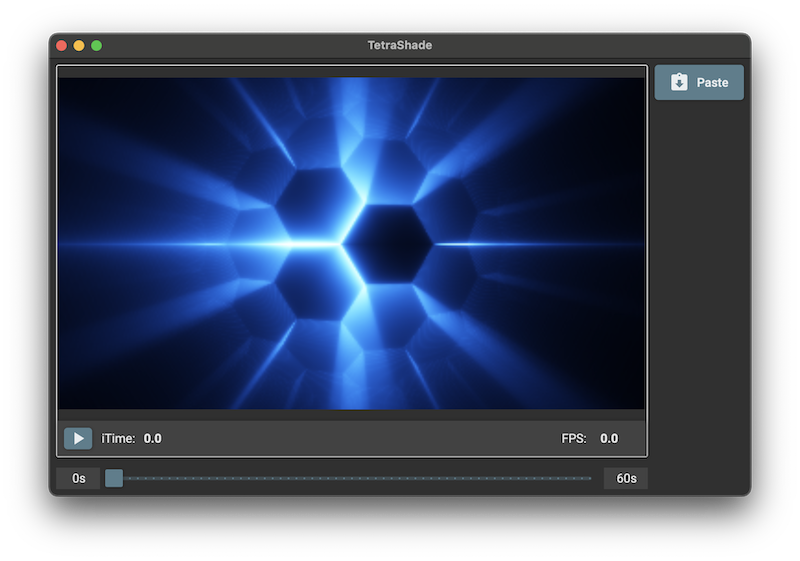

[](https://twitter.com/deanthecoder)
<p align="center">
  
</p>

# Tetra VM

**Tetra** is a custom bytecode language designed for numerical and graphical computation. It’s versatile enough for general purpose logic, but also for expressing GLSL-style shader behavior.

Tetra code is executed by a lightweight, cross-platform virtual machine runtime written in C#. Programs are made up of simple, low-level instructions using named variables, vector math, and clean control flow.

## TetraShade


**TetraShade** is a cross-platform UI for visualizing Tetra bytecode that simulates a fragment shader pipeline. Each pixel is computed by running the loaded Tetra code with a `fragCoord` input, allowing real-time visual output from shader-style programs.

Credit: ["Shield"](https://www.shadertoy.com/view/cltfRf) visual effect by [Xor](https://X.com/XorDev).

## 🛠️ Language Features

- **Scoped Variable Stack**: Each block or function has its own variable frame. Stack frames are explicitly
  pushed/popped using `push_frame` / `pop_frame`.
- **Named Variables**: No general-purpose registers. All values are stored and looked up by name.
- **Conditional and Unconditional Jumps**: Support for jump labels like `mylabel:` and instructions like `jmp`,
  `jmp_ne`, `jmp_ge`, etc.
- **Multi-element Float Vector Support**: Support for `vec4` operations alongside scalar floats.
- **Basic Arithmetic**: Instructions like `add`, `sub`, `inc`, `dec`.
- **Debugging Aids**: A `print` instruction that outputs variable values along with the line number of the source
  instruction.
- **Globals Support**: A global frame is automatically pushed on startup. Any code variables defined at the root level are treated as
  global initialization.

## 📌 Example Tetra Programs

### 🥧 Pi Approximation

Demonstrates use of arithmetic, loops, and alternating signs to compute an approximation of π using the Leibniz formula:

```tetra
ld $sum, 0
ld $sign, 1
ld $i, 0
ld $limit, 800

loop:
    jmp_ge $i, $limit, done
    ld $denominator, $i
    mul $denominator, 2
    add $denominator, 1
    ld $term, 1.0
    div $term, $denominator
    mul $term, $sign
    add $sum, $term
    neg $sign
    inc $i
    jmp loop

done:
    mul $sum, 4
    print $sum
    halt
```

#### Output
```
sum = 3.1403f
```
### 🧮 Fibonacci Sequence

Recursively computes and prints the first 10 [Fibonacci numbers](https://en.wikipedia.org/wiki/Fibonacci_sequence) using
function calls and control flow:

```tetra
ld $i, 0
ld $count, 10

loop:
    jmp_ge $i, $count, done
    ld $arg0, $i
    call fib
    print $retval
    inc $i
    jmp loop

done:
    halt

fib:
    ld $n, $arg0
    jmp_le $n, 1, base_case
    ld $arg0, $n
    dec $arg0
    call fib
    ld $a, $retval
    ld $arg0, $n
    dec $arg0
    dec $arg0
    call fib
    ld $b, $retval
    add $a, $b
    ret $a

base_case:
    ret $n
```

#### Output
```
retval = 0
retval = 1
retval = 1
retval = 2
retval = 3
retval = 5
retval = 8
retval = 13
retval = 21
retval = 34
```

## 🧮 Vector Support

Tetra supports first-class vector values. You can declare vector literals using `ld` with multiple float constants or float variables:

```tetra
ld $v, 1.1, -2.0, 3.0, 4.2
ld $v, $a, $b
```

The result is a float vector. Arithmetic operations like `add`, `mul`, and `sub` apply **per element** when two vectors are used:

```tetra
ld $a, 1.0, 2.0, 3.0
ld $b, 0.5, 0.5, 0.5
mul $a, $b   # $a becomes [0.5, 1.0, 1.5]
```

Unary operations like `neg` apply to each element:

```tetra
neg $a       # $a becomes [-0.5, -1.0, -1.5]
```

When combining a scalar with a vector, the scalar is broadcast across the vector’s components:

```tetra
ld $a, 8.0
ld $b, 6.0, 5.0
min $a, $b   # $a becomes [min(8.0, 6.0), min(8.0, 5.0)]
```

### 🔍 Vector Element Access

Individual vector components can be accessed using index notation:

```tetra
ld $v, 1.1, 2.2, 3.3
ld $a, $v[1]     # $a = 2.2
```

You can also construct new vectors from specific elements of an existing vector (swizzling):

```tetra
ld $v, 1.1, 2.2, 3.3
ld $a, $v[1], $v[0]   # $a = [2.2, 1.1]
```

Vector elements can be assigned to directly:

```tetra
ld $v, 1.1, 2.2, 3.3
ld $v[1], 3.141   # $v = [1.1, 3.141, 3.3]
```

Any instruction that operates on scalars (like `inc`, `mul`, `jmp_eq`, etc.) can also target a specific vector component:

```tetra
inc $v[2]
mul $a, $v[1]
jmp_eq $a, $v[2], label
```

Accessing vector elements from non-vector variables will throw a runtime error.

## Instruction Set

### 🔢 Arithmetic

#### ➕ Basic Arithmetic

| Instruction     | Description |
|-----------------|-------------|
| `add $a, $b`    | `$a = $a + $b` |
| `sub $a, $b`    | `$a = $a - $b` |
| `mul $a, $b`    | `$a = $a * $b` |
| `div $a, $b`    | `$a = $a / $b` |
| `inc $a`        | `$a = $a + 1` |
| `dec $a`        | `$a = $a - 1` |
| `neg $a`        | `$a = -$a` |
| `mod $a, $b`    | `$a = $a % $b` (modulo operation) |

#### 🧮 Exponential & Logarithmic

| Instruction     | Description |
|-----------------|-------------|
| `exp $a, $b`    | `$a = exp($b)` (e to the power of `$b`) |
| `log $a, $b`    | `$a = log($b)` (natural logarithm of `$b`) |
| `pow $a, $b`    | `$a = pow($a, $b)` |

#### 📐 Common Math

| Instruction     | Description |
|-----------------|-------------|
| `abs $a, $b`    | `$a = abs($b)` |
| `sign $a, $b`   | `$a = sign($b)` (-1, 0, or 1 depending on sign of `$b`) |
| `min $a, $b`    | `$a = min($a, $b)` |
| `max $a, $b`    | `$a = max($a, $b)` |

#### 📏 Trigonometric

| Instruction     | Description |
|-----------------|-------------|
| `sin $a, $b`    | `$a = sin($b)` |
| `cos $a, $b`    | `$a = cos($b)` |
| `tan $a, $b`    | `$a = tan($b)` |
| `asin $a, $b`   | `$a = asin($b)` |
| `acos $a, $b`   | `$a = acos($b)` |
| `atan $a, $b`   | `$a = atan($b)` |
| `sinh $a, $b`   | `$a = sinh($b)` |
| `cosh $a, $b`   | `$a = cosh($b)` |
| `tanh $a, $b`   | `$a = tanh($b)` |

### 🔄 Control Flow

| Instruction              | Description |
|--------------------------|-------------|
| `jmp label`              | Unconditional jump |
| `jmp_eq $a, $b, label`   | Jump if `$a == $b` |
| `jmp_ne $a, $b, label`   | Jump if `$a != $b` |
| `jmp_lt $a, $b, label`   | Jump if `$a < $b` |
| `jmp_le $a, $b, label`   | Jump if `$a <= $b` |
| `jmp_gt $a, $b, label`   | Jump if `$a > $b` |
| `jmp_ge $a, $b, label`   | Jump if `$a >= $b` |

### 📦 Variables and Frames

| Instruction         | Description |
|----------------------|-------------|
| `ld $a, 1.0`         | Load constant into `$a` |
| `ld $b, $a`          | Copy variable `$a` into `$b` |
| `push_frame`         | Push a new scope frame manually (used for block scoping) |
| `pop_frame`          | Pop the current scope frame |

### 🔁 Function Calls

| Instruction      | Description |
|------------------|-------------|
| `call label`     | Call function at `label` (creates a new scope frame and pushes return address) |
| `ret`            | Return from function (restores return address and previous scope) |
| `ret $a`         | Return a value; sets `$retval` in the caller's scope |

### 🐞 Debugging & Program Control

| Instruction  | Description |
|--------------|-------------|
| `print $a`   | Print the value of `$a` with line number |
| `nop`        | 💤 Does nothing. Useful for padding or jump targets. |
| `halt`       | Stop execution |

## 🔁 Function Calls

Tetra supports calling functions using the `call` instruction, with optional return values via `ret $value`.

### Argument Passing Convention

To pass arguments to a function, use `ld` to define named variables like `$arg0`, `$arg1`, etc., **before** calling the function:

```
ld $arg0, 10
ld $arg1, 20
call my_function
```

When `call` is executed:
- A new scope frame is pushed onto the call stack.
- The function code begins execution at the specified label.
- All variables, including `$arg0`, `$arg1`, etc., remain **shared with the caller** because they were defined outside the frame. As such, these arguments behave like **`out` parameters**.

If the function modifies `$arg0`, the change is visible to the caller:
```
add $arg0, 5  # caller sees modified value
```

### Creating Isolated Parameters (Read-Only Style)

If you want function parameters to behave like 'pass by value' (copied and isolated), you must explicitly copy them into local variables at the start of the function:

```
ld $a, $arg0
ld $b, $arg1
```

This way, modifications to `$a` and `$b` do not affect the caller's `$arg0`/`$arg1`.

### Returning Values

To return a value, use `ret $value`. This sets `$retval` in the caller’s frame:

```
ret $result
```

In the caller:

```
call my_function
ld $x, $retval
```

If no value is returned, simply use `ret`.

### Example

```
    ld $arg0, 5
    call double
    ld $x, $retval
    print $x
    halt

double:
    ld $a, $arg0
    add $a, $a
    ret $a
```
```
Output: x = 10
```

## 🔮 Future Plans

- **GLSL Frontend**: Load and run `.tetra` shader files that implement a `main(vec2 fragCoord) -> vec4` function. This will allow real-time rendering using Tetra bytecode in a canvas (e.g., 320x240).
- **Uniforms Support**: Provide built-in global vector (`uniforms`) containing runtime values like `time`, `resolution`, etc.
- **Shadertoy Compatibility**: Goal is to support a rewritten Tetra version of common Shadertoy examples, including `iTime`, `fragCoord`, and trigonometric color effects.
- **GLSL-to-Tetra Compiler**: Load real GLSL Shadertoy-style code and compile it into Tetra bytecode.
- **Standard Library (`stdlib`)**: Expand available instructions with functions like `length`, `dot`, `normalize`, `clamp`, `step`, and `smoothstep`.
- **Optimization Pass**: Implement a basic optimizer to remove redundant instructions and streamline generated bytecode.
- **Extended Vector Math**: Add support for `cross`, `reflect`, and `refract` for more advanced lighting models.
- **Per-Pixel Optimization**: Analyze Tetra bytecode at runtime to determine the first instruction that depends on per-pixel inputs (like `fragCoord`). Run the code before this point once per frame, and parallelize only the remaining per-pixel portion. This should significantly reduce runtime overhead.
